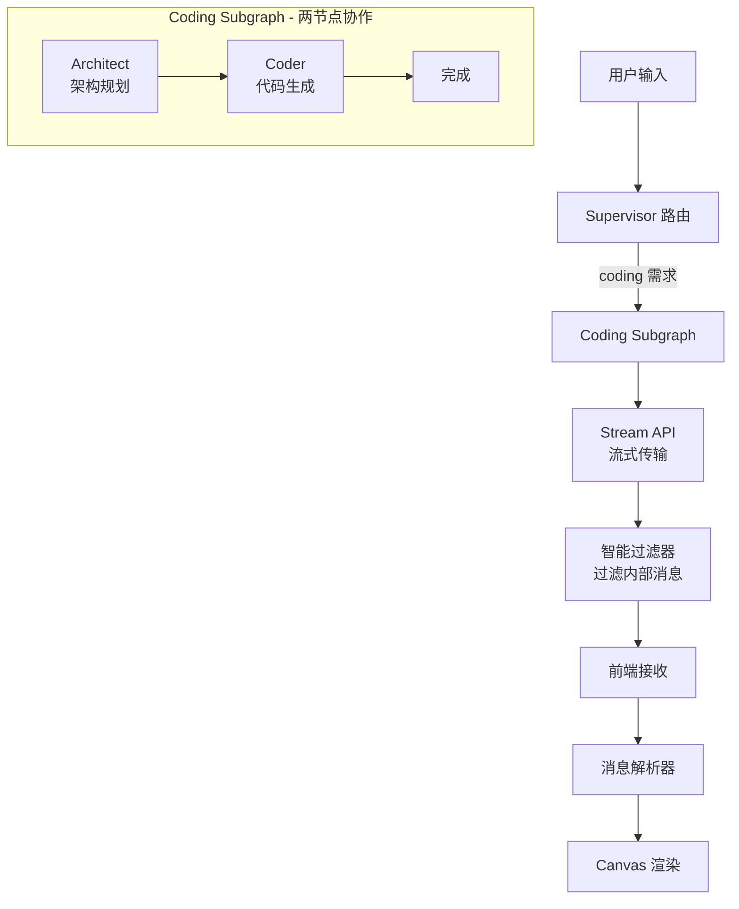
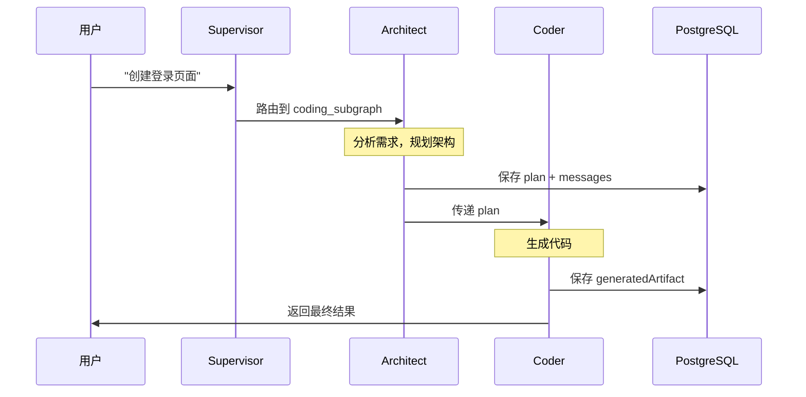
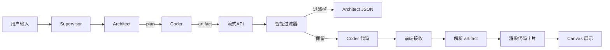

# Coding Subgraph 完整架构设计文档

> 从后端多智能体系统到前端渲染的完整技术方案

**文档版本**: 2.0  
**更新日期**: 2025-12-28  
**适用场景**: 代码生成、架构规划的完整工作流

**架构演进**: v2.0 移除了 Reviewer 节点，简化为 Architect → Coder 两节点架构，提升响应速度，降低成本

---

## 📋 目录

- [1. 架构概览](#1-架构概览)
- [2. 后端多智能体系统](#2-后端多智能体系统)
- [3. 消息流转机制](#3-消息流转机制)
- [4. 流式传输与过滤](#4-流式传输与过滤)
- [5. 前端消息处理](#5-前端消息处理)
- [6. 渲染层设计](#6-渲染层设计)
- [7. 完整数据流](#7-完整数据流)
- [8. 关键技术点](#8-关键技术点)

---

## 1. 架构概览

### 1.1 整体架构图



### 1.2 核心设计原则

| 原则           | 说明                 | 实现方式                |
| -------------- | -------------------- | ----------------------- |
| **关注点分离** | 架构、编码独立       | 两个独立的 Agent 节点   |
| **流式体验**   | 实时显示生成进度     | SSE + 增量渲染          |
| **智能过滤**   | 只展示用户需要的内容 | 基于元数据的过滤器      |
| **状态持久化** | 对话历史可恢复       | PostgreSQL Checkpointer |
| **错误容错**   | 网络失败自动降级     | Try-catch + 默认方案    |
| **快速响应**   | 减少不必要的处理环节 | 移除审查层，直接输出    |

---

## 2. 后端多智能体系统

### 2.1 Coding Subgraph 结构

**文件位置**: `lib/agent/index.ts`

```typescript
function createCodingSubgraph() {
  const codingWorkflow = new StateGraph(StateAnnotations)
    .addNode("architect", architect) // 步骤1: 架构规划
    .addNode("coder", coder) // 步骤2: 代码生成
    .addEdge(START, "architect")
    .addEdge("architect", "coder");

  return codingWorkflow.compile();
}
```

### 2.2 两个智能体详解

#### 2.2.1 Architect (架构师)

**职责**: 分析需求，规划文件结构和技术架构

**文件位置**: `lib/agent/nodes.ts`

**输入**:

```typescript
{
  messages: BaseMessage[],      // 对话历史
  codeContext?: string,         // 现有代码（修改模式）
}
```

**输出**:

```xml
<architectPlan>
{
  "mode": "create",
  "files": [
    { "path": "useAuth.ts", "description": "认证逻辑 Hook" },
    { "path": "LoginPage.tsx", "description": "登录页面组件" },
    { "path": "App.tsx", "description": "入口组件" }
  ],
  "dependencies": ["@/components/ui/button", "lucide-react"],
  "architecture_notes": "采用 Headless 架构分离逻辑与 UI"
}
</architectPlan>
```

**关键设计**: 使用 `<architectPlan>` 标签包裹 JSON，方便前端识别和解析

**Prompt 要点**:

- 识别是新建模式还是修改模式
- 遵循 Headless 架构原则（逻辑与 UI 分离）
- 移动端优先设计（w-full、触控友好）
- 所有文件放在根目录（沙箱限制）

#### 2.2.2 Coder (编码者)

**职责**: 根据架构规划生成完整代码

**输入**:

```typescript
{
  messages: BaseMessage[],
  plan: ArchitectPlan,          // Architect 的规划
  codeContext?: string,
}
```

**输出**:

```xml
<boltArtifact id="login-app" title="登录认证应用">
  <boltAction type="file" filePath="useAuth.ts">
export function useAuth() {
  // ... 完整代码
}
  </boltAction>
  <boltAction type="file" filePath="LoginPage.tsx">
export default function LoginPage() {
  // ... 完整代码
}
  </boltAction>
</boltArtifact>
```

**Prompt 要点**:

- 严格遵循 Architect 的文件规划
- 使用 `<boltArtifact>` 标签包裹代码
- 每个文件用 `<boltAction type="file">` 标记
- 确保代码完整可运行

---

## 3. 消息流转机制

### 3.1 状态管理

**文件位置**: `lib/agent/state.ts`

```typescript
export const StateAnnotations = Annotation.Root({
  messages: Annotation<BaseMessage[]>({
    reducer: (x, y) => x.concat(y),
    default: () => [],
  }),
  plan: Annotation<ArchitectPlan | null>({
    reducer: (_, y) => y,
    default: () => null,
  }),
  generatedArtifact: Annotation<string>({
    reducer: (_, y) => y,
    default: () => "",
  }),
  codeContext: Annotation<string | undefined>({
    reducer: (_, y) => y,
    default: () => undefined,
  }),
});
```

### 3.2 消息流转时序图



---

## 4. 流式传输与过滤

### 4.1 后端流式 API

**文件位置**: `app/api/agent/stream/route.ts`

```typescript
// 使用 streamEvents v2 获取流式响应
const eventStream = graph.streamEvents(
  { messages: [new HumanMessage(message)] },
  { ...config, version: "v2" }
);

for await (const event of eventStream) {
  if (event.event === "on_chat_model_stream" && event.data?.chunk?.content) {
    const content = event.data.chunk.content;

    // 智能过滤（关键！）
    if (shouldFilterContent(event, content)) {
      continue; // 跳过内部消息
    }

    // 发送到前端
    controller.enqueue(
      encoder.encode(
        `data: ${JSON.stringify({
          type: "content",
          content,
          threadId,
        })}\n\n`
      )
    );
  }
}
```

### 4.2 智能过滤器设计

**核心思想**: 基于事件元数据 + 内容特征的双重过滤

```typescript
// 定义需要过滤的节点（配置驱动）
const FILTERED_NODES = [
  "routeToSubgraph", // Supervisor 路由决策
  "architect", // 架构规划 JSON
];

function shouldFilterContent(event: StreamEvent, content: string): boolean {
  // 1. 基于事件元数据（优先）
  const eventTags = event.tags || [];
  const eventName = event.name || "";
  const isFilteredNode = FILTERED_NODES.some(
    (node) => eventTags.includes(node) || eventName.includes(node)
  );

  // 2. 基于内容特征（后备）
  const isInternalContent =
    content.includes("{") &&
    (content.includes('"next"') || content.includes('"mode"'));

  return isFilteredNode || isInternalContent;
}
```

### 4.3 过滤规则详解

| 类型                | 特征                                 | 示例          | 过滤原因                    |
| ------------------- | ------------------------------------ | ------------- | --------------------------- |
| **Supervisor 路由** | `{"next": "coding_subgraph"}`        | JSON 路由决策 | 内部逻辑，用户不需要看到    |
| **Architect 规划**  | `{"mode": "create", "files": [...]}` | 架构 JSON     | 给 Coder 用的，不是最终输出 |
| **Coder 代码**      | `<boltArtifact>...</boltArtifact>`   | 实际代码      | ✅ **保留**，这是用户需要的 |

---

## 5. 前端消息处理

### 5.1 消息接收与解析

**文件位置**: `hooks/use-chat.ts`

```typescript
// 从 SSE 流接收消息
const response = await fetch("/api/agent/stream", {
  method: "POST",
  body: JSON.stringify({ message, threadId }),
});

const reader = response.body.getReader();
const decoder = new TextDecoder();

while (true) {
  const { value, done } = await reader.read();
  if (done) break;

  const chunk = decoder.decode(value);
  const lines = chunk.split("\n");

  for (const line of lines) {
    if (line.startsWith("data: ")) {
      const data = JSON.parse(line.slice(6));

      if (data.type === "content") {
        // 累积内容
        currentContent += data.content;

        // 实时检测 artifact
        if (currentContent.includes("<boltArtifact")) {
          onArtifactDetected?.(currentContent);
        }

        // 更新消息
        setMessages((prev) => [
          ...prev.slice(0, -1),
          {
            ...assistantMessage,
            content: currentContent,
          },
        ]);
      }
    }
  }
}
```

### 5.2 Artifact 检测逻辑

```typescript
// 实时检测代码生成
if (currentContent.includes("<boltArtifact")) {
  // 触发回调，通知有代码生成
  onArtifactDetected?.(currentContent);

  // 标记消息包含 artifact
  assistantMessage.hasArtifact = true;
}
```

### 5.3 消息类型识别与智能渲染

**设计理念**: 不过滤内部消息，而是智能渲染为用户友好的展示形式。

#### 5.3.1 Architect 消息识别

**文件位置**: `components/chat/message-item.tsx`

**后端标签包裹** (`lib/agent/nodes.ts`):

```typescript
// Architect 输出时用标签包裹
const wrappedContent = `<architectPlan>\n${JSON.stringify(
  plan,
  null,
  2
)}\n</architectPlan>`;
return {
  messages: [new AIMessage(wrappedContent)],
  plan,
};
```

**前端标签解析**:

```typescript
function parseArchitectPlan(content: string): ArchitectPlan | null {
  // 通过标签提取 JSON（简单可靠）
  const match = content.match(
    /<architectPlan>\s*([\s\S]*?)\s*<\/architectPlan>/
  );
  if (!match) return null;

  const jsonStr = match[1].trim();
  const plan = JSON.parse(jsonStr);
  return plan;
}
```

**优势**:

- ✅ 解析简单 - 正则匹配标签即可
- ✅ 更可靠 - 不会因 JSON 格式问题误判
- ✅ 一致性 - 与 `<boltArtifact>` 保持相同设计模式
- ✅ 扩展性 - 即使 JSON 结构变化，标签仍能识别

#### 5.3.2 Architect 规划卡片

将原始 JSON 转换为友好的卡片展示：

```tsx
<ArchitectPlanCard plan={architectPlan}>
  {/* 紫色主题卡片 */}- 📁 文件结构: 显示所有规划的文件路径和描述 - 📦 技术栈: 显示依赖的组件库和工具
  - 💡 架构说明: 显示架构设计理念
</ArchitectPlanCard>
```

**视觉效果**：

- 紫色主题（区别于代码生成的蓝/绿色）
- 可折叠展开查看详情
- 图标 + 文件结构清晰展示

#### 5.3.3 消息渲染优先级

```typescript
export function MessageItem({ message }: MessageItemProps) {
  // 1. Architect 规划 → 紫色架构卡片
  if (parseArchitectPlan(message.content)) {
    return <ArchitectPlanCard />;
  }

  // 2. Coder 代码 → 蓝/绿色代码卡片
  if (message.hasArtifact) {
    return <GenerationCard />;
  }

  // 3. 普通聊天 → 灰色聊天气泡
  return <ChatBubble />;
}
```

#### 5.3.4 过滤策略演进

**v1.0 方案（已废弃）**: 过滤掉所有 Architect 消息

- ❌ 用户看不到工作流程
- ❌ 流式生成时会短暂显示 JSON
- ❌ "逃避问题"而非"解决问题"

**v2.0 方案（当前）**: 智能渲染内部消息

- ✅ 将 Architect JSON 转换为友好卡片
- ✅ 用户了解完整的 AI 工作流程
- ✅ 提升透明度和信任感
- ✅ 只过滤纯内部逻辑（Supervisor 路由）

---

## 6. 渲染层设计

### 6.1 消息类型判断

**文件位置**: `components/chat/message-item.tsx`

```typescript
export function MessageItem({ message }: MessageItemProps) {
  // 判断是否是代码生成消息
  const isCodingMessage =
    message.hasArtifact || message.content.includes("<boltArtifact");

  if (isCodingMessage) {
    return <GenerationCard {...props} />; // 显示代码卡片
  } else {
    return <ChatBubble {...props} />; // 显示普通聊天气泡
  }
}
```

### 6.2 代码卡片组件

```tsx
function GenerationCard({ artifact, isGenerating, isCompleted }: Props) {
  // 状态配置
  const statusConfig = {
    generating: {
      icon: Loader2,
      text: "生成中...",
      className: "text-blue-500 animate-spin",
    },
    completed: {
      icon: CheckCircle2,
      text: "生成完成",
      className: "text-green-500",
    },
  };

  return (
    <div className="border rounded-lg p-4">
      {/* 状态指示器 */}
      <StatusIndicator {...statusConfig[status]} />

      {/* 文件列表 */}
      {artifact?.files.map((file) => (
        <FileItem key={file.path} file={file} />
      ))}

      {/* 展开按钮 */}
      <Button onClick={onExpand}>在 Canvas 中打开</Button>
    </div>
  );
}
```

### 6.3 Canvas 面板

**文件位置**: `components/canvas/canvas-panel.tsx`

```tsx
export function CanvasPanel({ versions, selectedVersion }: Props) {
  return (
    <div className="flex flex-col h-full">
      {/* Tab 切换 */}
      <Tabs value={activeTab} onValueChange={setActiveTab}>
        <TabsList>
          <TabsTrigger value="preview">预览</TabsTrigger>
          <TabsTrigger value="code">代码</TabsTrigger>
        </TabsList>

        <TabsContent value="preview">
          <PreviewPanel iframeRef={iframeRef} />
        </TabsContent>

        <TabsContent value="code">
          <CodePanel files={currentFiles} />
        </TabsContent>
      </Tabs>

      {/* 版本选择器 */}
      <VersionSelector versions={versions} />
    </div>
  );
}
```

---

## 7. 完整数据流

### 7.1 用户请求 → 代码生成

```
1. 用户输入: "创建一个登录页面"
   ↓
2. Supervisor 路由: 识别为 coding 需求 → coding_subgraph
   ↓
3. Architect 规划:
   {
     "files": ["useAuth.ts", "LoginPage.tsx", "App.tsx"],
     "dependencies": ["@/components/ui/button"],
     ...
   }
   🚫 前端不显示（被过滤）
   ↓
4. Coder 生成:
   <boltArtifact id="login-app" title="登录认证应用">
     <boltAction type="file" filePath="useAuth.ts">...</boltAction>
     <boltAction type="file" filePath="LoginPage.tsx">...</boltAction>
     <boltAction type="file" filePath="App.tsx">...</boltAction>
   </boltArtifact>
   ✅ 流式传输到前端 → 实时渲染
   ↓
5. 前端渲染:
   - 显示代码卡片（GenerationCard）
   - 状态从"生成中"变为"生成完成"
   - 文件列表展示（useAuth.ts, LoginPage.tsx, App.tsx）
   - 可点击"在 Canvas 中打开"
```

### 7.2 数据流图



---

## 8. 关键技术点

### 8.1 为什么要过滤内部消息？

**问题场景**:

```
用户看到的消息流（过滤前）：
1. {"next": "coding_subgraph"}  ← Supervisor 路由决策
2. {"mode": "create", ...}      ← Architect 架构规划
3. <boltArtifact>...</boltArtifact>  ← Coder 代码
```

**用户困惑**: "这些 JSON 是什么？"

**解决方案**: 智能过滤

```
用户看到的消息流（过滤后）：
1. <boltArtifact>...</boltArtifact>  ← 只显示代码
```

### 8.2 配置驱动 vs 硬编码

**❌ 硬编码方式（不推荐）**:

```typescript
if (content.includes('"mode"') && content.includes('"files"')) {
  continue; // 过滤 Architect
}
if (content.includes("APPROVE")) {
  continue; // 过滤 Reviewer
}
```

- 维护困难
- 不易扩展
- 容易出错

**✅ 配置驱动方式（推荐）**:

```typescript
const FILTERED_NODES = ["routeToSubgraph", "architect"];
const isFiltered = FILTERED_NODES.some((node) => eventName.includes(node));
```

- 集中管理
- 易于扩展
- 代码清晰

### 8.3 流式渲染的优势

| 方面         | 传统方式           | 流式方式       |
| ------------ | ------------------ | -------------- |
| **响应速度** | 等待全部生成完成   | 立即开始显示   |
| **用户体验** | 长时间等待（30s+） | 实时进度反馈   |
| **取消支持** | 难以中断           | 随时可取消     |
| **错误处理** | 全有或全无         | 部分成功也可用 |

### 8.4 状态持久化

**使用 PostgreSQL Checkpointer**:

```typescript
const graph = supervisorWorkflow.compile({
  checkpointer: postgresCheckpointer,
});

// 每个节点执行后自动保存
// - messages
// - plan
// - generatedArtifact
```

**好处**:

- 对话可恢复（刷新页面不丢失）
- 支持暂停/继续
- 便于调试和回溯

---

## 9. 最佳实践

### 9.1 Prompt 设计原则

1. **明确输出格式**: 使用示例而非描述
2. **限制输出范围**: 避免冗余信息
3. **错误处理**: 提供降级方案
4. **迭代优化**: 根据实际输出调整

### 9.2 性能优化

1. **温度控制**: 架构规划用 0.3，代码生成用 0.1
2. **超时设置**: 避免长时间等待（30s）
3. **重试机制**: 解析失败时自动重试
4. **流式优先**: 实时反馈提升用户体验

### 9.3 错误处理

```typescript
try {
  const response = await llm.invoke(messages);
  return { messages: [response], plan };
} catch (error) {
  console.error("Architect error:", error);
  return {
    messages: [new AIMessage("架构规划失败，使用默认方案")],
    plan: {
      /* 默认方案 */
    },
  };
}
```

---

## 10. 常见问题

### Q1: 为什么不使用三智能体架构（增加 Reviewer）？

**A**: 基于实际测试，现代 LLM 生成代码质量已经很高

- **测试结果**: 多次测试从未触发审查不通过
- **负面影响**:
  - 延迟增加 2-3 秒
  - 额外 LLM 调用成本
  - 可能误判好代码
- **用户反馈更精准**: 用户发现问题后直接要求调整，比 AI 审查更准确
- **架构更简洁**: Architect → Coder 足够清晰，减少 30% 调用成本

### Q2: 如果生成的代码有问题怎么办？

**A**: 用户反馈循环更高效

- 用户可以直接描述问题："修改按钮颜色为蓝色"
- 系统进入修改模式，只更新相关文件
- 比自动审查更精准，避免过度迭代

### Q3: 如何展示内部消息（Architect、Supervisor）？

**A**: 智能渲染，而非简单过滤（v2.0 设计理念）

1. **Architect 规划**:

   - ✅ 不过滤，转换为友好的架构卡片
   - 紫色主题，显示文件结构、技术栈、架构说明
   - 让用户了解 AI 的工作流程，提升透明度

2. **Supervisor 路由**:

   - 🚫 过滤掉，纯内部逻辑决策
   - 对用户没有价值（如 `{"next": "coding_subgraph"}`）

3. **Coder 代码**:
   - ✅ 显示为代码卡片，蓝/绿色主题
   - 文件列表 + Canvas 预览

**设计理念**: "透明化 AI 工作流程，提升用户信任感"  
**实现位置**: `components/chat/message-item.tsx` - `ArchitectPlanCard` 组件

---

## 11. 扩展阅读

- [LangGraph 官方文档](https://langchain-ai.github.io/langgraph/)
- [流式 SSE 实现](https://developer.mozilla.org/en-US/docs/Web/API/Server-sent_events)
- [React 19 新特性](https://react.dev/blog/2024/04/25/react-19)
- [Tailwind CSS 移动优先设计](https://tailwindcss.com/docs/responsive-design)

---

**文档维护**: 随着系统演进持续更新  
**反馈渠道**: 遇到问题请查阅日志并提交 Issue
